# UI - Final Designs

Esta sección presenta los diseños finales de la interfaz de usuario del sistema.
Los diseños están basados en los wireframes previamente definidos y siguen una guía visual consistente para garantizar una experiencia de usuario clara y accesible.

## Diseño completo

URL del diseño UI:
(https://stitch.withgoogle.com/projects/16882425488911801641)

---

# Autenticación

## /inicio_sesion

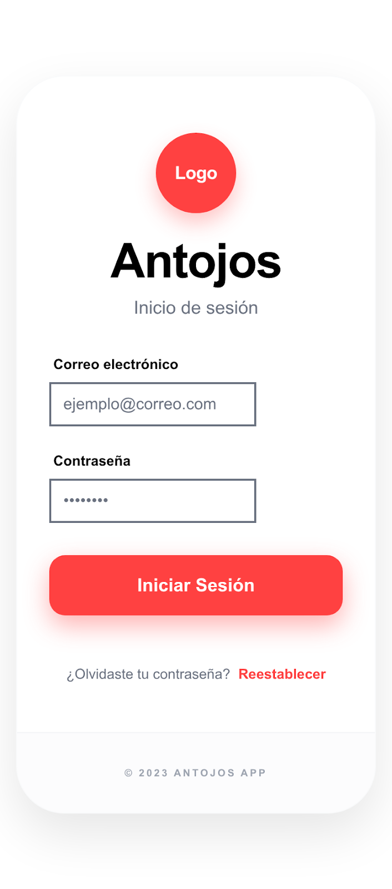

Diseño final de la pantalla donde los usuarios ingresan sus credenciales para acceder al sistema.

---

## /registro_cliente

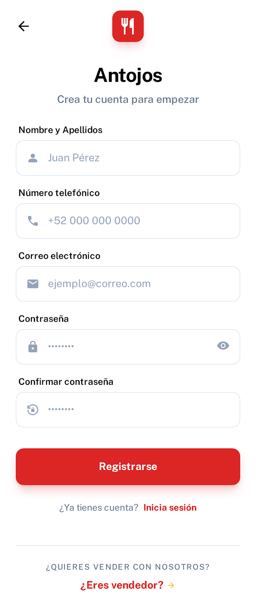

Pantalla de registro para nuevos clientes dentro de la plataforma.

---

## /registro_vendedor

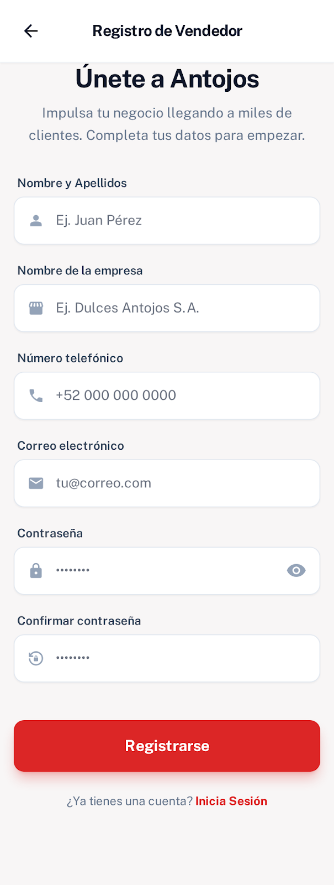

Pantalla donde los vendedores pueden registrarse para ofrecer productos.

---

## /completar_registro_vendedor

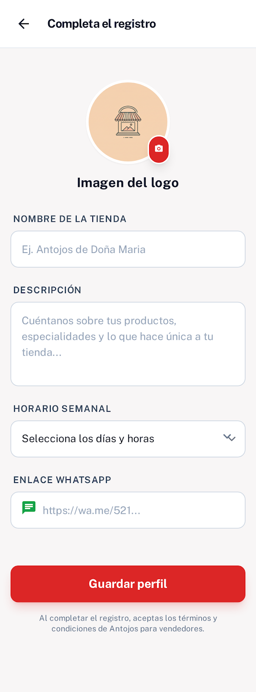

Pantalla donde el vendedor completa la información adicional requerida para activar su cuenta.

---

# Navegación principal

## /home_cliente

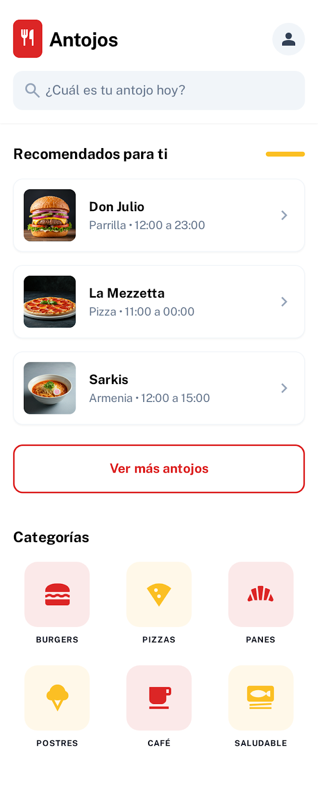

Pantalla principal del cliente donde puede explorar productos y realizar búsquedas.

---

## /home_vendedor

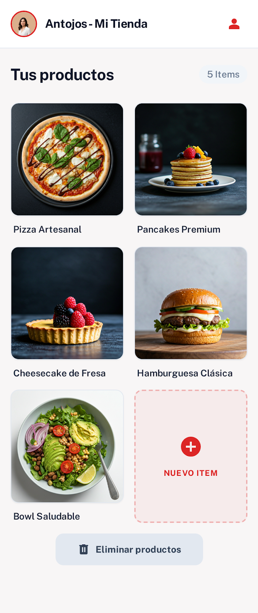

Panel principal del vendedor donde puede administrar su tienda y productos.

---

# Búsqueda de productos

## /buscador_cliente

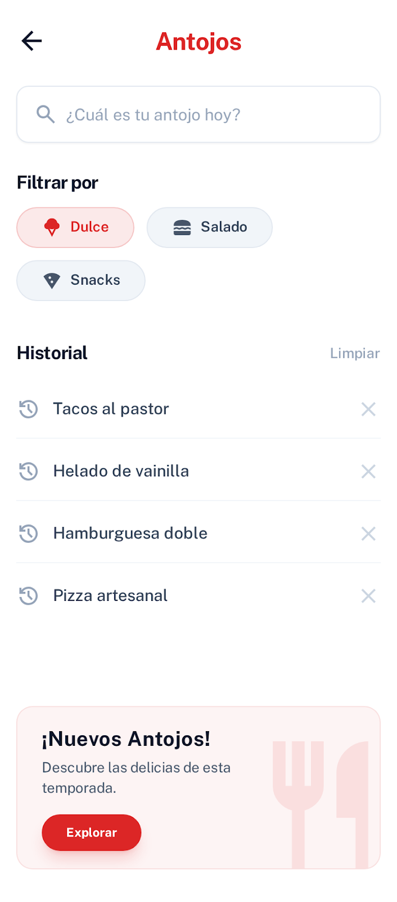

Pantalla donde el cliente puede buscar productos dentro de la plataforma.

---

## /busqueda_filtro

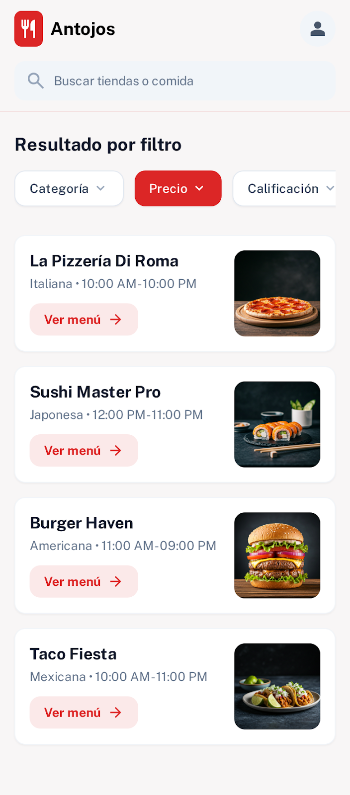

Pantalla que permite aplicar filtros para refinar los resultados de búsqueda.

---

## /resultado_busqueda

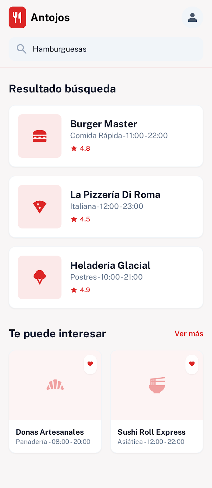

Pantalla donde se muestran los productos encontrados tras realizar una búsqueda.

---

# Información del producto

## /detalle_producto

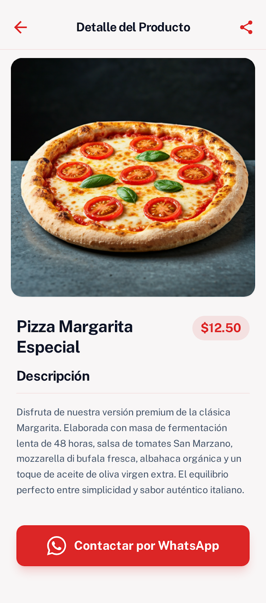

Pantalla donde se visualiza la información detallada de un producto.

---

## /detalle_tienda

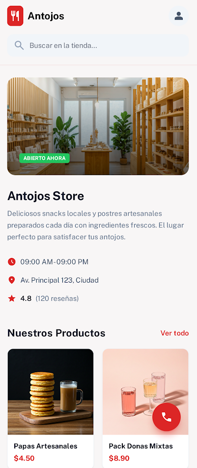

Pantalla donde se muestra la información de la tienda o vendedor.

---

# Perfil de usuario

## /perfil_cliente

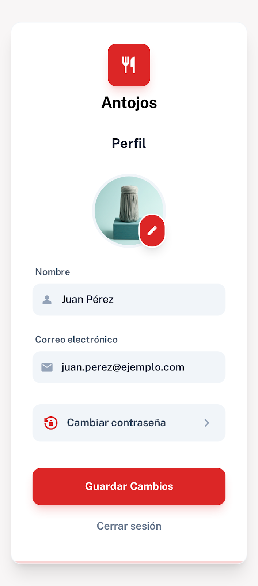

Pantalla donde el cliente puede visualizar y editar su información personal.

---

## /perfil_vendedor

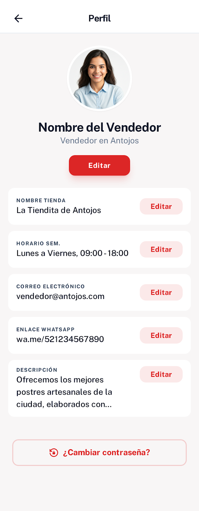

Pantalla donde el vendedor puede administrar su perfil y los productos que ofrece.

---

## /editar_componente_vendedor

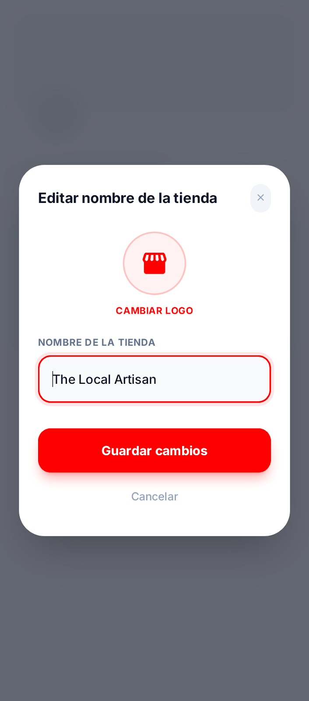

Pantalla donde el vendedor puede editar los elementos o componentes relacionados con su tienda o productos.

---

# Seguridad

## /pantalla_bloqueo

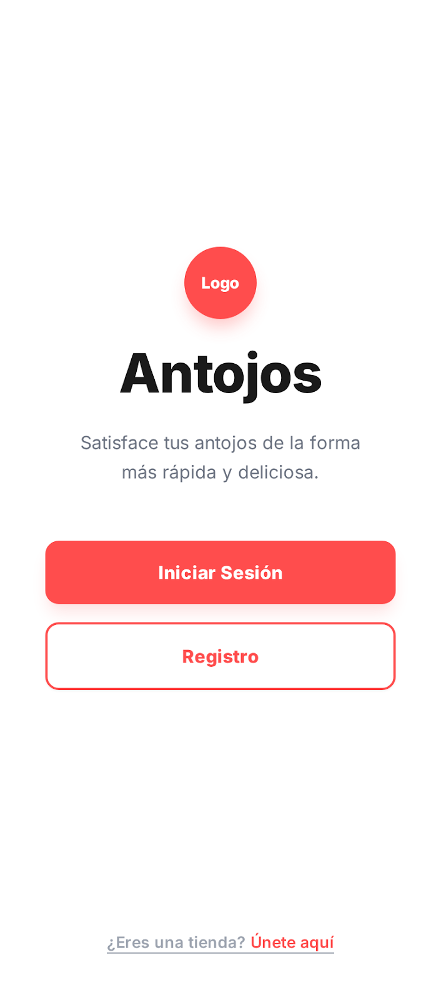

Pantalla que aparece cuando el acceso al sistema está restringido o bloqueado.