# UX - Wireframes

Esta sección presenta los wireframes del sistema.  
Los wireframes representan la estructura inicial de las pantallas del producto y permiten visualizar la organización de los elementos antes de implementar el diseño visual final.

## Documento completo de wireframes

[Ver documento completo de wireframes]()

---

# Autenticación

## /inicio_sesion

Pantalla donde los usuarios ingresan sus credenciales para acceder al sistema.

---

## /registro_cliente

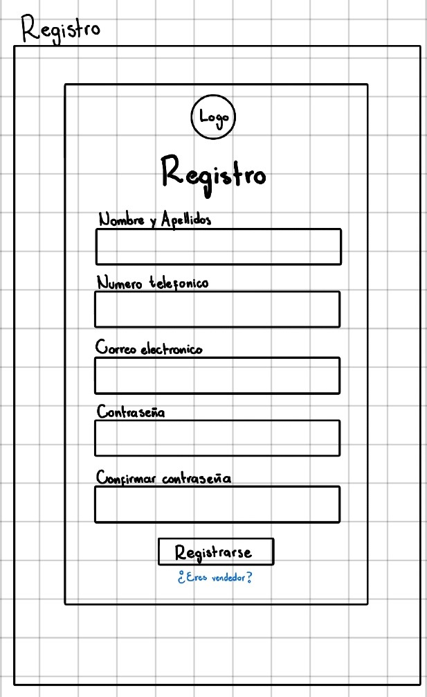

Pantalla donde los clientes crean una cuenta en la plataforma.

---

## /registro_vendedor

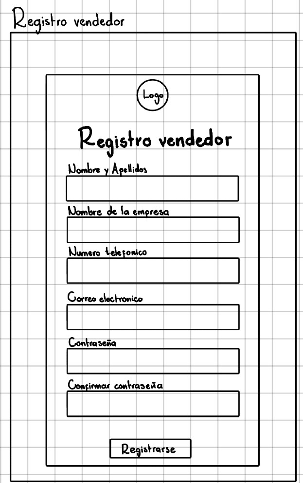

Pantalla donde los vendedores se registran para poder ofrecer productos.

---

# Navegación principal

## /pagina_principal

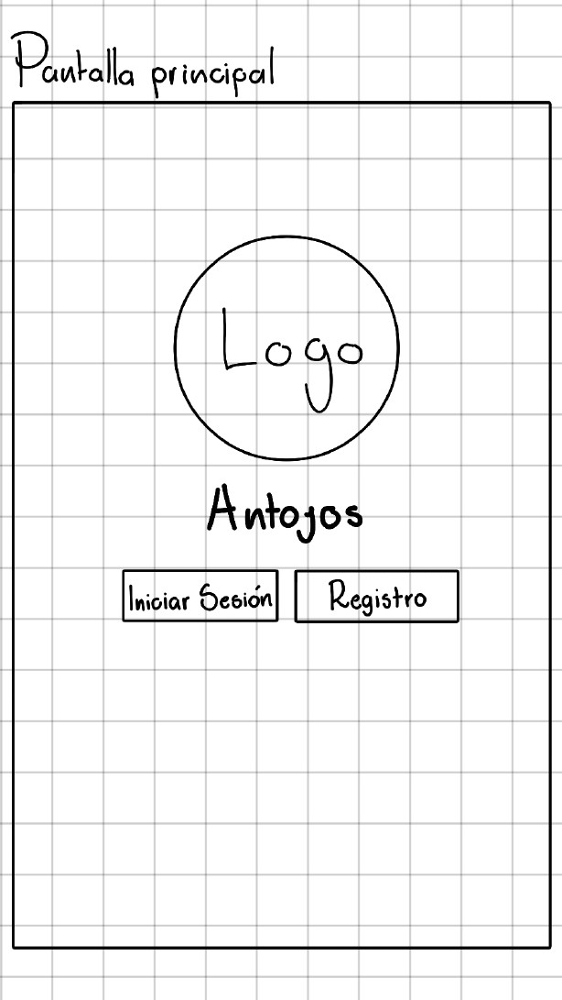

Pantalla principal desde donde el usuario puede navegar por la plataforma.

---

## /home_cliente

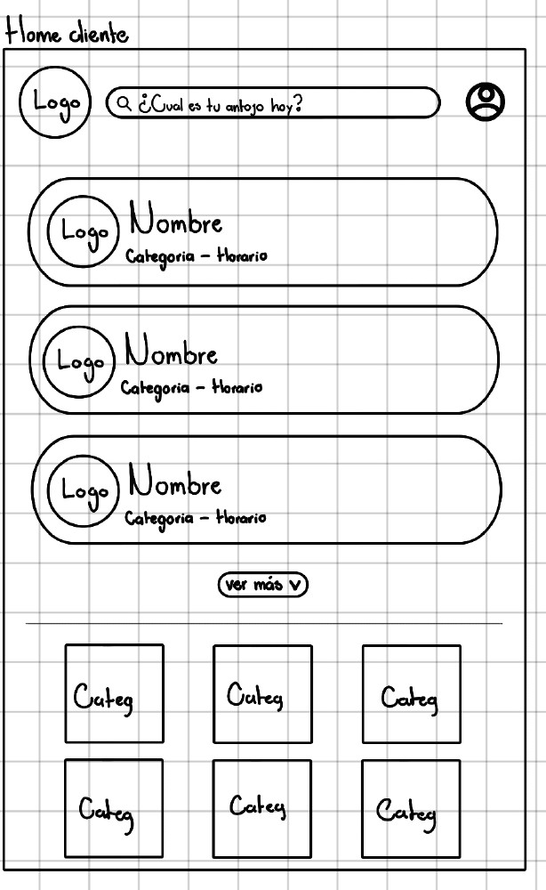

Pantalla principal del cliente donde puede buscar productos y explorar tiendas.

---

## /home_vendedor

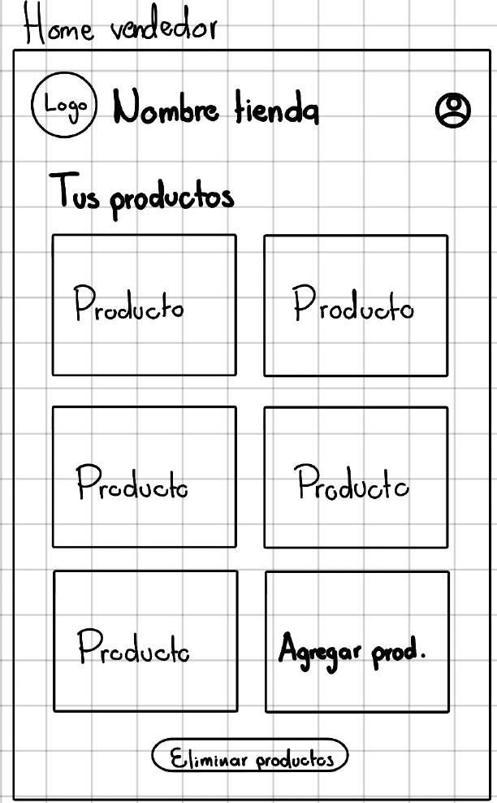

Panel principal del vendedor para gestionar su tienda y productos.

---

# Búsqueda de productos

## /buscador_cliente

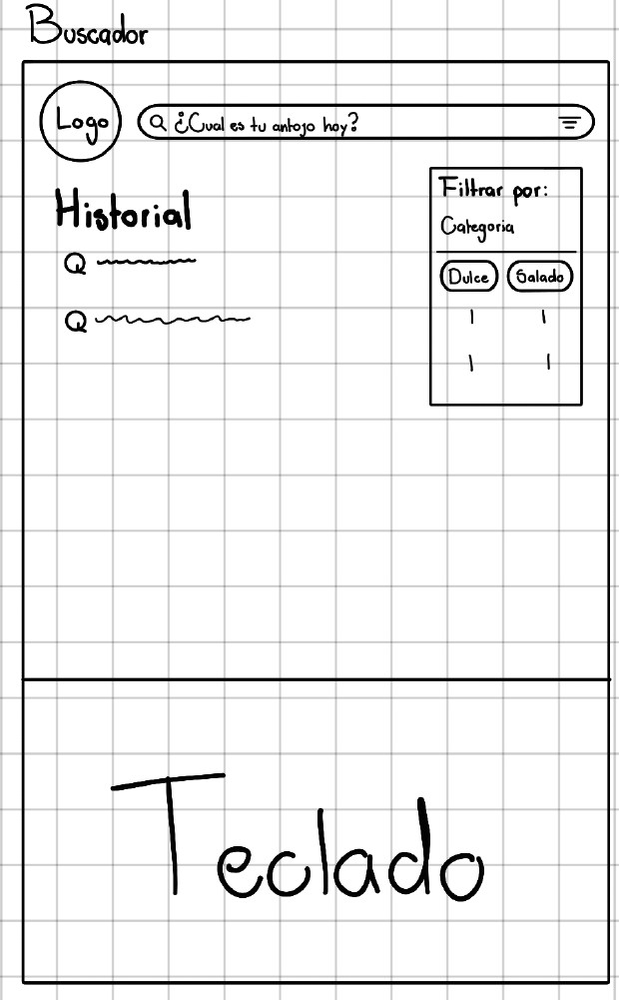

Pantalla donde el usuario puede buscar productos.

---

## /resultado_busqueda

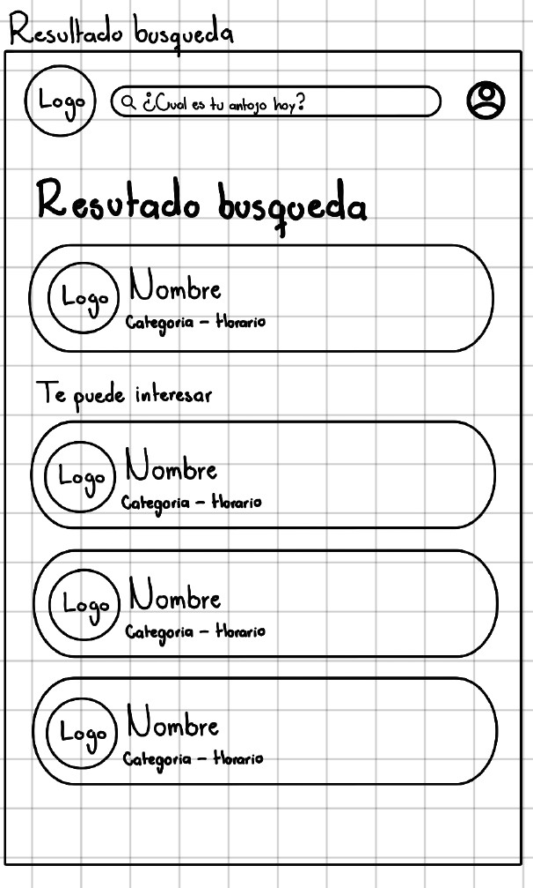

Pantalla que muestra los resultados obtenidos tras realizar una búsqueda.

---

## /resultado_filtro

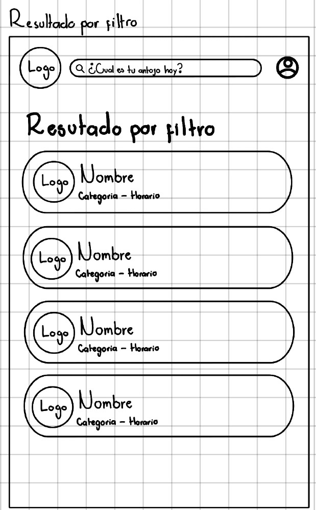

Pantalla que muestra los productos filtrados según criterios seleccionados.

---

# Información del producto

## /detalle_producto

Pantalla que muestra la información completa de un producto.

---

## /detalle_tienda

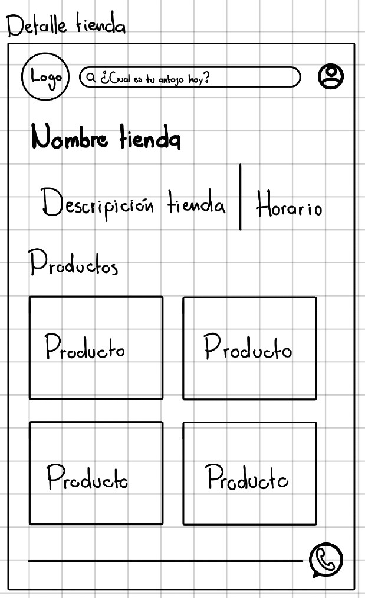

Pantalla donde el usuario puede visualizar información de la tienda o vendedor.

---

# Perfil de usuario

## /perfil_cliente

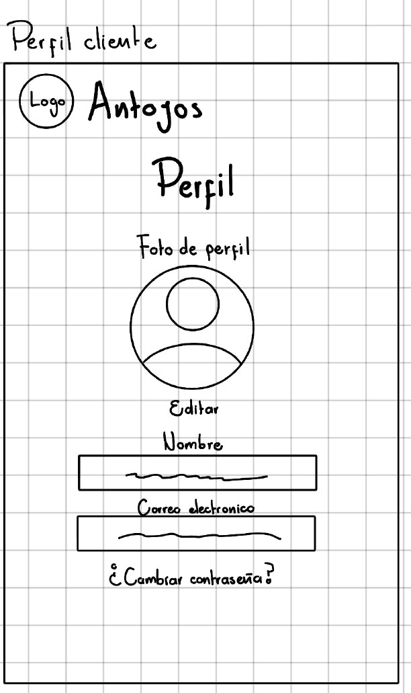

Pantalla donde el cliente puede visualizar y editar su perfil.

---

## /perfil_vendedor

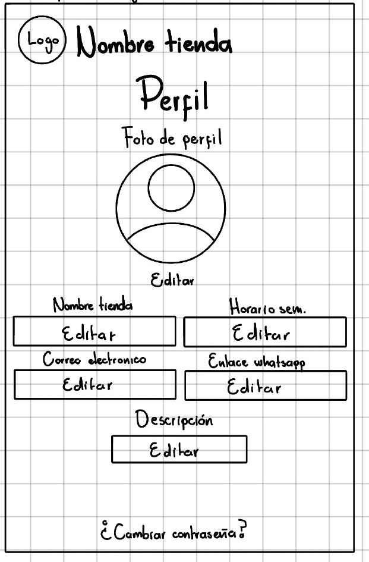

Pantalla donde el vendedor puede administrar su perfil y productos.